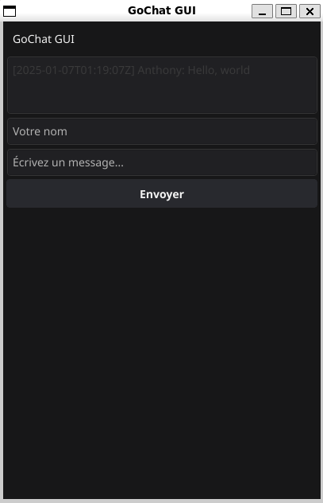

# GoChat GUI

GoChat GUI is designed as an educational project for developers who want to explore the integration of a graphical user interface (GUI) with a robust backend written in Go. This application demonstrates how to use Fyne for GUI development and SQLite for lightweight, persistent storage.

## Features
- **Real-time Chat Interface**: Send and view messages in a user-friendly graphical interface.
- **SQLite Database**: Store chat messages locally with a persistent database.
- **User Input**: Add a username and chat messages dynamically.

# Project
  
